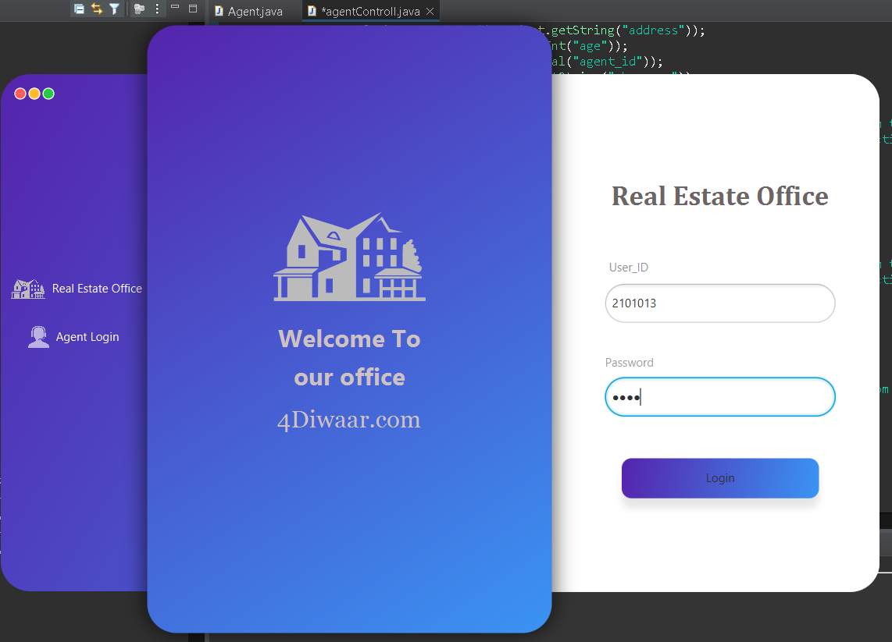
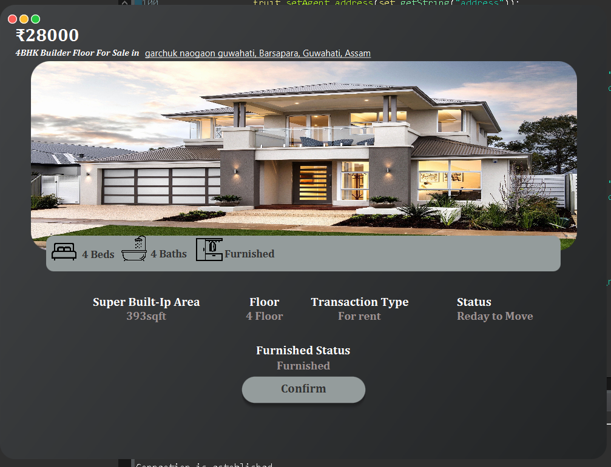
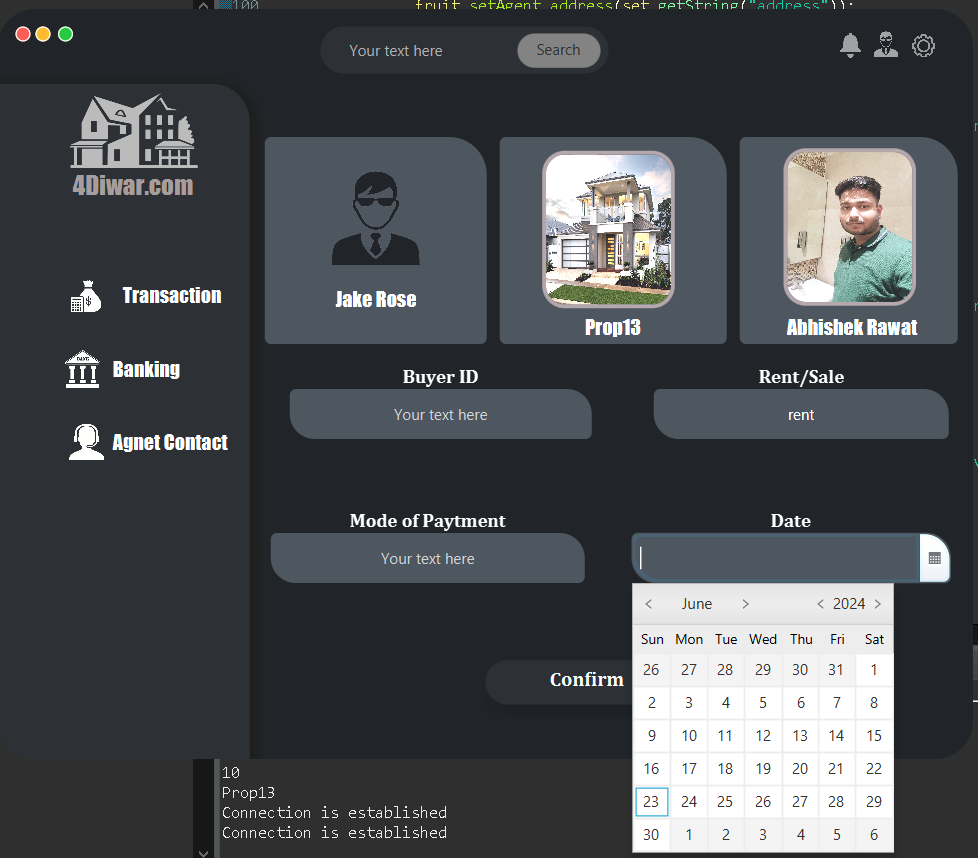

# RealEstateManager

RealEstateManager offers efficient property management using SQL, JavaFX, and AWS database technologies.

- Seamlessly integrates JavaFX for a user-friendly interface.
- Leverages AWS database for scalability and reliability.
- Enhances real estate operations with cloud-based efficiency.

## Screenshots

### Welcome Screen


### Login Screen


### Market Place


### Agent Office


### Agent Sale Report


### Transaction Page


### Transaction Page


## Features

- User-friendly interface using JavaFX
- Scalable and reliable database management with AWS
- Efficient real estate operations management

## Technologies Used

- **JavaFX**: For building the user interface.
- **AWS Database**: For scalable and reliable data storage.
- **SQL**: For database management.

## Getting Started

1. Clone the repository
   ```bash
   git clone https://github.com/Big-Leu/Real_state.git


